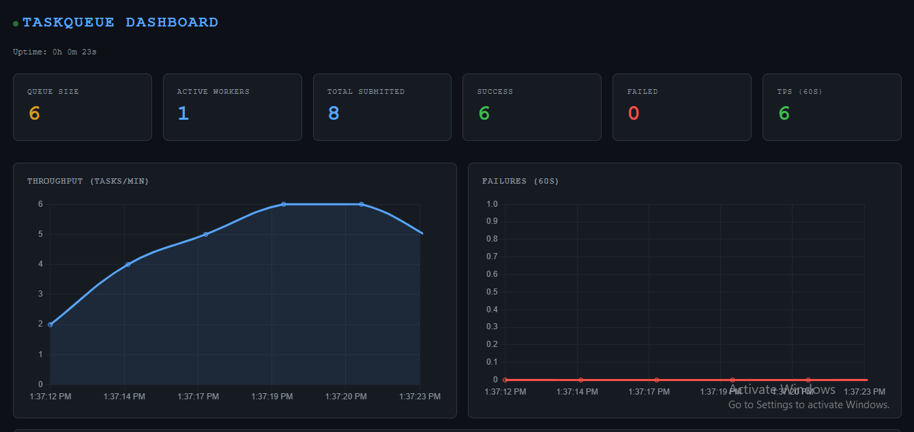

# distributed-task-queue

Built this to understand how task queues like Celery actually work under the hood — not by reading docs, but by building one from scratch.

I'm an EEE student at NIT Goa who got into systems programming. Most projects I saw online were either too simple or just wrappers around existing tools. I wanted to know what happens at the socket level, how workers coordinate, what makes a system fault-tolerant. So I built it.

No Celery. No Redis. No shortcuts.



---

## What it does

You submit a task. It goes into a priority queue on the broker. A worker picks it up, executes it in a separate process, and sends the result back.

If the worker dies mid-task, the broker detects it via heartbeat timeout and requeues the task automatically. If a task fails, it retries with exponential backoff. If it keeps failing after max retries, it goes into a dead letter queue. Everything is persisted to SQLite so a broker restart doesn't lose tasks.

---

## How to run

Three terminals.

```bash
# terminal 1 — start the broker
python -m broker.server

# terminal 2 — start a worker (run multiple for concurrency)
python -m worker.worker

# terminal 3 — start the dashboard
python -m dashboard.app
```

Submit tasks:

```bash
python main.py
```

Dashboard → http://localhost:8000

---

## Usage

Basic:

```python
from client.client import Client

client = Client()
client.submit_task("add", 2, 3, priority=5)
```

With the decorator:

```python
from client.decorators import task

@task(priority=2, retries=3)
def add(a, b):
    return a + b

r = add.delay(2, 3)
print(r.wait_for_result())   # 5
```

Async result API:

```python
r = add.delay(10, 20)

r.get_status()                  # "pending" / "running" / "success" / "failed"
r.get_result()                  # result if done, None otherwise
r.wait_for_result(timeout=10)   # blocks until done or timeout
```

---

## Project structure

```
broker/
    server.py       asyncio TCP broker, handles all connections
    queue.py        priority queue with round-robin tiebreaking
    scheduler.py    FIFO, round robin, least loaded policies

worker/
    worker.py       connects to broker, executes tasks in process pool,
                    sends heartbeats every 3s

client/
    client.py       TCP client, submits tasks to broker
    decorators.py   @task decorator, registers functions into registry
    result.py       AsyncResult — get_status, get_result, wait_for_result

shared/
    task.py         Task model
    tasks.py        task registry — maps name strings to functions
    protocol.py     encode/decode messages over TCP
    database.py     SQLite — insert, update, recover tasks
    logger.py       append-only logs for tasks and workers

dashboard/
    app.py          FastAPI server, REST endpoints, live charts

main.py             example — submit tasks and fetch results
```

---

## Design decisions and why

**Length-prefixed protocol over raw TCP**

TCP is a stream. If you just send JSON back to back, the receiver has no idea where one message ends and the next begins. Every message is prefixed with a 4-byte header that tells the receiver exactly how many bytes to read next.

**ProcessPoolExecutor instead of threads**

Python's GIL means threads can't run CPU-bound code in parallel — only one thread executes at a time. Workers use ProcessPoolExecutor to spawn actual OS processes, each with their own GIL, so tasks run in true parallel.

**Heartbeat-based failure detection**

Workers send a heartbeat to the broker every 3 seconds. If the broker hasn't heard from a worker in 10 seconds, it marks it dead, requeues any task it was running, and removes it from the registry. No manual intervention needed.

**SQLite for persistence**

Every task is written to the database on submission. On broker restart, the first thing it does is query for tasks still in `pending` or `running` state and load them back into the queue. The system picks up exactly where it left off.

**Exponential backoff on retries**

Retrying instantly after a failure doesn't help if the underlying issue needs time to resolve. Failed tasks wait 2^retry_count seconds between attempts — 1s, 2s, 4s — before being sent to the dead letter queue after max retries.

**Priority queue with counter tiebreaker**

Python's PriorityQueue compares the full tuple on equal priorities. Comparing Task objects directly would crash since Task has no `<` operator. A monotonically increasing counter as the second tuple element breaks ties cleanly and preserves submission order within the same priority.

---

## What I learned

- How to build a TCP server from scratch using asyncio
- Why message framing matters and how to implement it
- The GIL — what it is, when it matters, and when to use processes instead of threads
- How heartbeat systems work for failure detection in distributed systems
- SQLite as a lightweight persistence layer for crash recovery
- Priority queues, scheduling algorithms, and the tradeoffs between them
- Building REST APIs with FastAPI and serving live data to a frontend

---

## Stack

| | |
|---|---|
| Broker | Python asyncio, raw TCP sockets |
| Workers | ProcessPoolExecutor, threading |
| Persistence | SQLite |
| Dashboard | FastAPI, Chart.js |
| Protocol | JSON over length-prefixed TCP frames |
| Language | Python 3.13 |

---

## Install

```bash
pip install fastapi uvicorn
```

Everything else is Python standard library.

---

## Inspired by

- [Celery](https://docs.celeryq.dev/) — what this is modeled after
- [RabbitMQ](https://www.rabbitmq.com/) — broker concepts
- [Build Your Own X](https://github.com/codecrafters-io/build-your-own-x) — general philosophy
